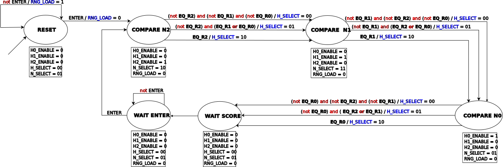
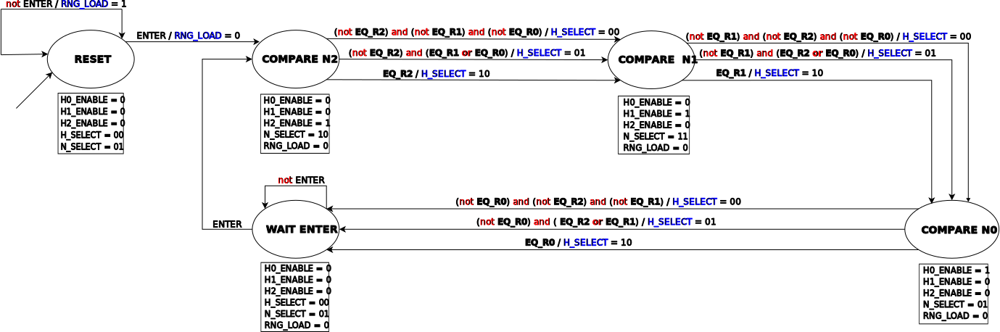
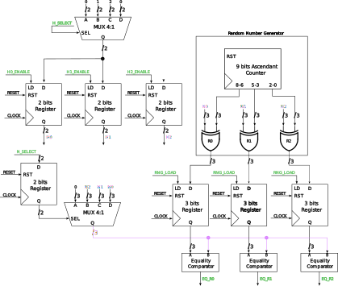

# Jogo de Adivinhação de Números

**Usando metodologia RTL**, o projeto deve implementar um jogo que crie, de
forma pseudoaleatória, três números de 3 bits cada e armazene internamente sem
exibir nos LEDs (pode haver repetição). Em seguida, inicia-se um processo de
tentativas de adivinhação dos números, conforme detalhado nesta especificação.

Um dos push buttons, KEY(0), deve ser usado como reset assíncrono de **todos**
os elementos síncronos do projeto. O reset pode ser considerado o início do
jogo (não é necessário usar uma chave para iniciar, portanto a FSM da
controladora não precisa ser cíclica).

Outro push button, KEY(1), deve ser usado como uma "tecla ENTER", para informar
ao jogo que uma tentativa de adivinhação está inserida nas 9 chaves,
SW(0) a SW(8), e o jogo deve avaliar a tentativa.

A cada tentativa de adivinhação, logo após o "ENTER", o jogo deve exibir nos
primeiros displays de set segmentos (HEX0, HEX1, e HEX2) os seguintes códigos,
de acordo com a comparação entre cada um dos 3 números da tentativa nas chaves
e os 3 sorteados no início, **para cada posição**:

**0)** se o respectivo número não existe entre os 3 sorteados\
**1)** se o respectivo número existe entre os 3 sorteados, mas **não** na
posição certa\
**2)** se o respectivo número existe na posição informada na tentativa

Mesmo havendo repetição, as opções são mutuamente exclusivas.

## FSM Controladora

### Com WAIT SCORE

O estado "WAIT SCORE" é provavelmente inútil, mas uma versão sem ele não foi
testada na placa

Legenda:

- Vermelho: operações lógicas
- Azul: saídas variáveis
- Negrito: entradas do caminho de dados
- Itálico: entradas de interface com a placa

### Sem WAIT SCORE

Legenda:

- Vermelho: operações lógicas
- Azul: saídas variáveis
- Negrito: entradas do caminho de dados
- Itálico: entradas de interface com a placa

## Caminho de dados

Legenda:

- Verde: sinais com a FSM Controladora
- Rosa: sinais de interface com a placa
- Itálico: sinais de saída
- Roxo: apenas uma maneira de diferenciar entre os fios

